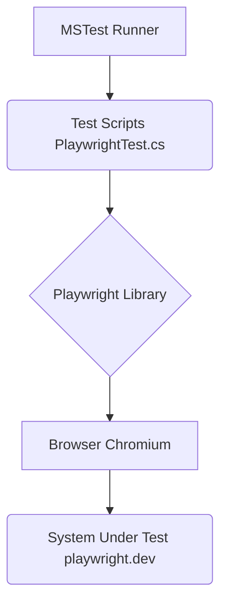

# automaton-v28

Automation testing framework (UI) - an example. Based on C#, .Net8, MSTest, Playwright

[](https://github.com/BurhanH/automaton-v28/blob/master/LICENSE)
[](https://github.com/BurhanH/automaton-v28/actions/workflows/dotnet-mstest.yml)


## Requirements
.Net8, Playwright, <br>
MSTest<br>

## Project structure
```text
-- automaton-v28
   `-- .github
       `-- workflows
           |-- dotnet-mstest.yml
   `-- MSTestPlaywright
       |-- GlobalUsing.cs
       |-- MSTestPlaywright.csproj
       |-- MSTestPlaywright.sln
       |-- PlaywrightTest.cs
   |-- .gitignore
   |-- LICENSE
   |-- README.md
```

## Documentation and Distributives

1. [C#](https://learn.microsoft.com/en-us/dotnet/csharp/)
2. [.Net](https://dotnet.microsoft.com/en-us/learn/dotnet/what-is-dotnet)
3. [MSTest](https://learn.microsoft.com/en-us/dotnet/core/testing/unit-testing-csharp-with-mstest)
4. [Playwright](https://playwright.dev/dotnet/)
5. [GitHub Actions](https://github.com/features/actions)

## Architecture


This project uses MSTest as the test runner to execute test scripts written in C#. The test scripts leverage the Playwright library to automate browser interactions. Playwright, in turn, controls a browser instance (Chromium in this case) to interact with the system under test, which is the playwright.dev website.
